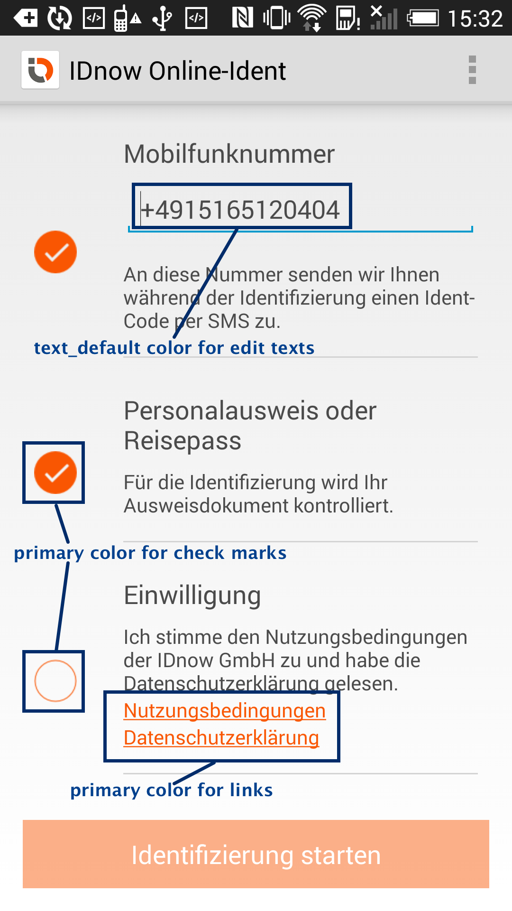
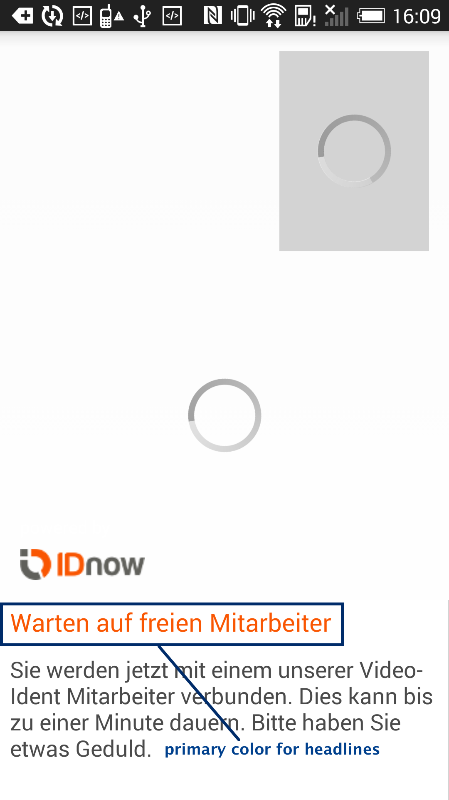
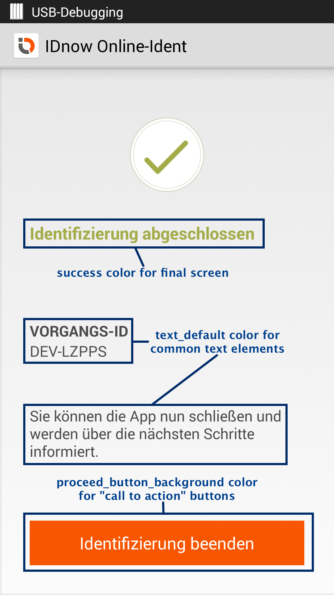

# Table of Contents

- [Overview](#overview)
  - [Examples](#examples)
  - [Requirements](#requirements)
  - [AndroidManifest](#androidmanifest)
- [Android Studio](#android-studio)
  - [How to import the SDK](#how-to-import-the-sdk)
  - [How to use the .aar file](#how-to-use-the-aar-file)
  - [App Bar](#app-bar)
  - [SDK size](#sdk-size)
- [Multidex support](#multidex-support)
- [Proguard support](#proguard-support)
- [Usage](#usage)
- [Additional settings](#additional-settings)
- [Using IDnow with other native libraries (UnsatisfiedLinkError)](#using-idnow-with-other-native-libraries-unsatisfiedlinkerror)
- [Design configuration](#design-configuration)
  - [App icon and logo](#app-icon-and-logo)
    - [Colors](#colors)
    - [text_default](#text_default)
    - [primary](#primary)
    - [proceed_button_background](#proceed_button_background)
    - [failure](#failure)
    - [success](#success)
    - [screenshots](#screenshots)
    - [overwriting default colors](#overwriting-default-colors)
  - [App theme](#app-theme)
    - [Action bar](#action-bar)
- [Texts](#texts)

## Overview

This SDK supports AndroidStudio.

### Examples

Please see https://github.com/idnow/de.idnow.android-sample for a sample applications

### Requirements

- minSdkVersion: 21  (Android 5.0)
- targetSdkVersion:	28 (Android 9.0 Pie)
- Internet connection, communication via standard SSL port 443

### AndroidManifest

The following permissions are required:

```
<uses-permission android:name="android.permission.ACCESS_NETWORK_STATE"/>
<uses-permission android:name="android.permission.INTERNET"/>
<uses-permission android:name="android.permission.WRITE_EXTERNAL_STORAGE"/>
<uses-permission android:name="android.permission.CAMERA" />
<uses-permission android:name="android.permission.FLASHLIGHT" />
```

If Video-Ident will be used, the following permissions are required as well:


```
<uses-permission android:name="android.permission.MODIFY_AUDIO_SETTINGS" />
<uses-permission android:name="android.permission.RECORD_AUDIO" />
```

Additional permissions for certain audio devices:

```
<uses-permission android:name="android.permission.BLUETOOTH"/>
<uses-permission android:name="android.permission.BLUETOOTH_ADMIN"/>
```

Moreover, when using an Android LibraryProject, all the Activities, Services and <uses-feature> from the LibraryProject (SDK) have to be mentioned in your Apps AndroidManifest. The simplest way is just to copy the corresponding part of the IDnowSDK AndroidManifest.

## Android Studio

### How to import the SDK

[](https://youtu.be/KUtcXqgo3F8)

In your top-level build.gradle project file add the following url under repositories block :

```
allprojects {
repositories {
..
maven {
url "https://raw.githubusercontent.com/idnow/de.idnow.android/master"
}
..
}
}
```

and in the dependencies part of your app.gradle add :   

```
dependencies {
..
implementation 'de.idnow.sdk:idnow-android-sdk:4.x.x'
..
}
```

### How to use the .aar file:

[](https://youtu.be/_ti2lbcfIqM)

Copy the idnow-android-.aar into the apps libs folder.

In your app.gradle add:

```
repositories {
flatDir {
dirs 'libs' //this way we can find the .aar file in libs folder
}
}
```

Additional dependencies to add in your app.gradle :

``` 
dependencies {
    implementation 'de.idnow.sdk:idnow-android-x.x.x@aar'
    implementation 'com.squareup.retrofit:retrofit:1.9.0'
    implementation 'com.squareup.okhttp3:okhttp:3.12.1'
    implementation 'com.android.support:support-v4:28.0.0'
    implementation 'com.android.support:support-annotations:26.1.0'
    implementation 'com.googlecode.libphonenumber:libphonenumber:8.4.2'
    implementation 'io.sentry:sentry-android:1.7.16'
    implementation "androidx.constraintlayout:constraintlayout:1.1.3"
    implementation 'me.relex:circleindicator:1.3.2'
    debugImplementation 'com.squareup.leakcanary:leakcanary-android:2.0'
    }
```

### App Bar

During the use of the SDK the app is NOT showing an App Bar since the ident follows exact predefined steps the user can't influence and because there is nothing to search for.

### SDK size

By default the SDK has a size of roughly 17 mb. This especially includes the necessary native code for WebRTC. If you need to lower the size of your delivered APK for some reason, we advice to use APK splitting (see https://developer.android.com/google/play/publishing/multiple-apks.html)

You can do that by adding the following code to your project:

```
android {
    // Some other configuration here...

    splits {
        abi {
            enable true
            reset()
            include 'x86', 'armeabi', 'armeabi-v7a', 'mips'
            universalApk false
        }
    }
}
```

## Multidex support

Your project might require the usage of multidex if it comes over 65k methods. Please see http://developer.android.com/tools/building/multidex.html for details

## Proguard support

A proguard file is supplied in this project as well.

## Usage

The ONLY class in the SDK designated for user access is the IDnowSDK class.

To create an instance of the IDnow SDK, perform the following call and provide the companyid, which was provided to you during setup as well as an activity that receives callbacks. IDnowSDK is a singleton class, so whenever you need to call it just do so with IDnowSDK.getInstance().

```
IDnowSDK.getInstance().initialize(<Activity>, "<companyid>");
```

Set the static parameters for the SDK usage. Context has to be passed, as parameters are persisted in Preferences. You can decide whether to let the user confirm legal agreements (setShowVideoOverviewCheck).
You also can decide if after the identification the IDnow Error/SuccessScreen is shown, or if the callback to your app is triggered right after identification is finished.

```
IDnowSDK.setShowVideoOverviewCheck(<true/false>, <Context>);
IDnowSDK.setShowErrorSuccessScreen(<true/false>, <Context>);
```

To actually start the identification pass your transaction token.

```
IDnowSDK.getInstance().start(<Your transaction token>);
```

Here is the full example:


```java
try {
	// Initialize with your activity which will handle the SDK callback and pass the id of your company.
	//	IDnowSDK is a singleton class, so just call it with IDnowSDK.getInstance()
	IDnowSDK.getInstance().initialize(StartActivity.this, "ihreBank");

	// Set the transactionToken, for example from a TextField
	IDnowSDK.setTransactionToken(editTextToken.getText().toString(), context);

	// You can decide whether to let the user confirm the legal points.
	IDnowSDK.setShowVideoOverviewCheck(true, context);

	// Same goes to the success screen. If none is shown, the app sends the results right back.
	// The defaults for the both parameters are "true";
	IDnowSDK.setShowErrorSuccessScreen(true, context);

	// Optionally set against which environment the app has to test. Possibilities are DEV, TEST, LIVE, with LIVE being the default.
	IDnowSDK.setEnvironment( Server.TEST );

	// To actually start the identification process, pass the transactionToken.
	IDnowSDK.getInstance().start(IDnowSDK.getTransactionToken(context));
} catch (Exception e) {
	// The SDK checks the input parameters and throws an exception if they don't seem right.
	e.printStackTrace();
}
```

The SDK checks the input parameters and throws an Exception if something is deemed not right, to provide you with quick feedback. Handle it as desired.

To handle the results of the identification, implement the standard onActivityResult function in your activity.:

```
	@Override
	protected void onActivityResult( int requestCode, int resultCode, Intent data )
	{
		if ( requestCode == IDnowSDK.REQUEST_ID_NOW_SDK )
		{
			if ( resultCode == IDnowSDK.RESULT_CODE_SUCCESS )
			{
                If ( data != null )
                {
                    String transactionToken = data.getStringExtra(IDnowSDK.RESULT_DATA_TRANSACTION_TOKEN);
                    Log.v(TAG, "success, transaction token: " + transactionToken);
                }
			}
			else if ( resultCode == IDnowSDK.RESULT_CODE_CANCEL )
			{
                if ( data != null )
                {
                    String transactionToken = data.getStringExtra(IDnowSDK.RESULT_DATA_TRANSACTION_TOKEN);
                    String errorMessage = data.getStringExtra(IDnowSDK.RESULT_DATA_ERROR);
                    Log.v(TAG, "canceled, transaction token: " + transactionToken + “, error: “ + errorMessage);
                }
			}
			else if ( resultCode == IDnowSDK.RESULT_CODE_FAILED )
			{
                if ( data != null )
                {
                    String transactionToken = data.getStringExtra(IDnowSDK.RESULT_DATA_TRANSACTION_TOKEN);
                    String errorMessage = data.getStringExtra(IDnowSDK.RESULT_DATA_ERROR);
                    Log.v(TAG, "failed, transaction token: " + transactionToken + “, error: “ + errorMessage);
                }
			}
			else
			{
				Log.v(TAG, "Result Code: " + resultCode);
			}
		}
	}

```

## Additional settings

You can set the connection type to use: Either use websockets (default) or long polling.

```
IDnowSDK.setConnectionType(IDnowSDK.ConnectionType.LONG_POLLING, context);
```

You can force one of the environments to use. Default is to determine this by the token used.

```
IDnowSDK.setEnvironment(IDnowSDK.Server.TEST);
```

You can disable logging of the SDK by using

```
IDnowSDK.disableLogging();
```

You can set to use your own servers. When this setting is enabled, apiHost, webHost and websocketHost must also be set.

```
IDnowSDK.setEnvironment(IDnowSDK.Server.CUSTOM);
IDnowSDK.setApiHost("https://api.yourserver.com", context);
IDnowSDK.setWebHost("https://www.yourserver.com", context);
IDnowSDK.setWebsocketHost("https://websocket.yourserver.com", context);
IDnowSDK.setVideoHost("https://video.yourserver.com", context);
IDnowSDK.setStunHost("video.yourserver.com", context);
IDnowSDK.setStunPort(3478, context);
```

## Using IDnow with other native libraries (UnsatisfiedLinkError)

For Videostreaming the Idnow SDK uses IceLink which come with native libs.

If your app uses other 3rd party libs that come with their own native libs, it's possible that you get an UnsatisfiedLinkError.

This means that the native lib folders shipped by your 3rd party lib don't match the native lib folders shipped by the Idnow SDK.
Currently the Idnow SDK comes with the following folders: armeabi, armeabi-v7a, arm64-v8a and x86.
If your 3rd party lib only supports some of the architectures but not others (e.g. armeabi, x86 but not armeabi-v7a), you have to exclude the other folders of the Idnow SDK in your build.gradle (in this example: armeabi-v7a) with the following command:

```
android {
//...
packagingOptions {
exclude "lib/armeabi-v7a/"
//...
}
```

If it's the other way round (your 3rd party lib ships more than armeabi, armeabi-v7a, arm64-v8a and x86, you have to exclude these folders, so the remaining folders match the Idnow SDK folders.

For further reading:
http://developer.android.com/ndk/guides/abis.html

## Design configuration


### App icon and logo

A single icon is used as the app launcher icon and logo. You can overwrite it, if you provide assets, named "ic_launcher.png",  in the following sizes in the drawable folders:

- mdpi: 48px * 48px
- hdpi: 72px * 72px
- xhdpi: 96px * 96px
- xxhdpi: 144px * 144px
- xxxhdpi: 192px * 192px

You must not declare it again in your app manifest.

### Colors

The IDnow SDK is designed with colors following the IDnow corperate design. You can use the SDK without making any adaptions to the colors at all. If, however you want the SDK screens to appear in different colors you can make the following adaptions:

#### text_default
Used as default color for display and editable texts
Default: a nearly black color
Recommendation: Should be some kind of a dark color that does not collide with white color.

#### primary
Optional color, that replaces the default brand color.
Default: an orange color
Used in headlines, checkboxes, links, alerts etc.
Recommendation: Should be a color that does not collide with white color.

#### proceed_button_background
Background color for confirmation/continue button, which is usually placed at the bottom of a screen
Default: the primary color (see above)

#### failure
Replaces the text color in the result screen, when an identification failed.
Default: A red color

#### success
Replaces the text color in the result screen, when an identification was successful.
Default: A green color

#### screenshots
Since pictures say more than words, here are some screenshots:
| |  |  |

#### overwriting default colors

This is how the colors.xml can look like:
```
<?xml version="1.0" encoding="utf-8"?>
<resources>

    <!-- Used by theme as default color for display and editable texts -->
    <color name="text_default">#4A4A4A</color>

    <!-- Primary color is used for headlines and links -->
    <color name="primary">#F95602</color>

    <!-- background color for confirmation/continue button, which is usually placed at the bottom of a screen -->
    <color name="proceed_button_background">@color/primary</color>

    <!-- "Wiederholen" button when a photo was taken in photo ident -->
    <color name="photo_ident_retake_button_background">@color/text_default</color>

    <!-- Colors of the result screen -->
    <color name="success">#A4AC49</color>
    <color name="failure">#E0727A</color>

</resources>
```

### App theme

This is themes.xml of the SDK:

```
<resources>

    <!-- IdnowSdkTheme is used when no other theme is applied. See documentation if you want to apply a different theme. -->

    <!-- Apply color "text_default" for text elements -->
    <style name="IdnowSdkTheme"
           parent="@android:style/Theme.Holo.Light">
        <!-- applying color "text_default" for common text elements -->
        <item name="android:textColor">@color/text_default</item>
        <item name="android:editTextStyle">@style/IdnowSdkTheme.EditText</item>
    </style>

    <style name="IdnowSdkTheme.EditText"
           parent="android:Widget.EditText">
        <!-- applying color "text_default" for edit text fields as text color -->
        <item name="android:textColor">@color/text_default</item>
    </style>

</resources>
```

As you can see, the theme is based on Holo Light. The only changes made here are applying color "text_default" to standard text elements and edit text fields.

You have three options:

- By not specifying a theme at all, the SDK's theme is used for the whole app.
- Inheriting from the SDK's theme. Here is a usage example (themes.xml):

```
<?xml version="1.0" encoding="utf-8"?>
<resources>

    <style name="MyAppTheme"
           parent="@style/IdnowSdkTheme">
    <!-- Your definitions here -->
    </style>

</resources>
```

- Applying own theme. In this case, it is your own responsibility to apply color "text_default" for standard and edit text elements.


#### Action bar

Here an example on how to set custom action bar colors when using Holo Light theme (themes.xml):
```
<?xml version="1.0" encoding="utf-8"?>
<resources>

    <style name="MyAppTheme"
           parent="@style/IdnowSdkTheme">
        <!-- applying custom actionbar style -->
        <item name="android:actionBarStyle">@style/MyAppTheme.ActionBar</item>
    </style>

    <style name="MyAppTheme.ActionBar"
           parent="@android:style/Widget.Holo.Light.ActionBar">
        <!-- Specify background color of actionbar -->
        <item name="android:background">@color/primary</item>
        <item name="android:titleTextStyle">@style/MyAppTheme.ActionBar.Title</item>
    </style>

    <style name="MyAppTheme.ActionBar.Title"
           parent="@android:style/TextAppearance.Holo.Widget.ActionBar.Title">
        <!-- Specify text color of actionbar -->
        <item name="android:textColor">@color/white</item>
    </style>

</resources>
```
## Texts

The SDK provides English, German, French, Spanish, Italian, Hungarian, Georgian, Korean, Dutch, Polish, Portuguese, Russian and Chinese    texts.
