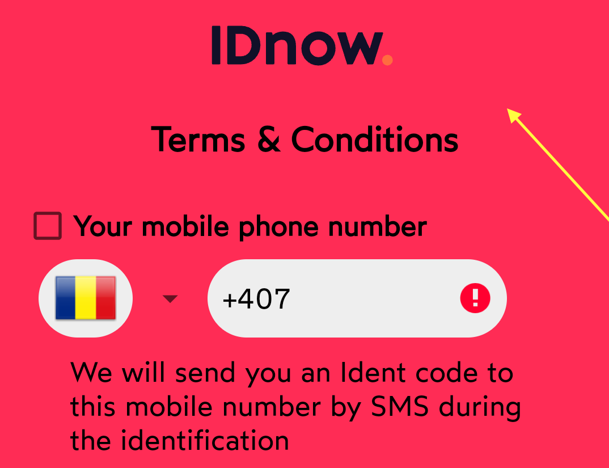
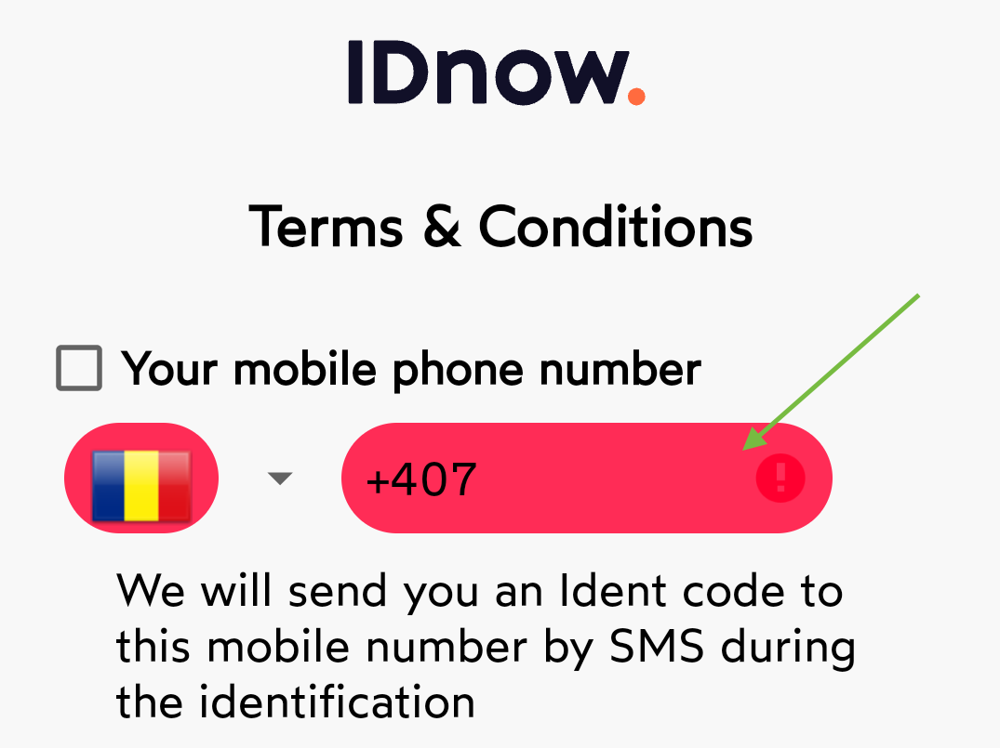
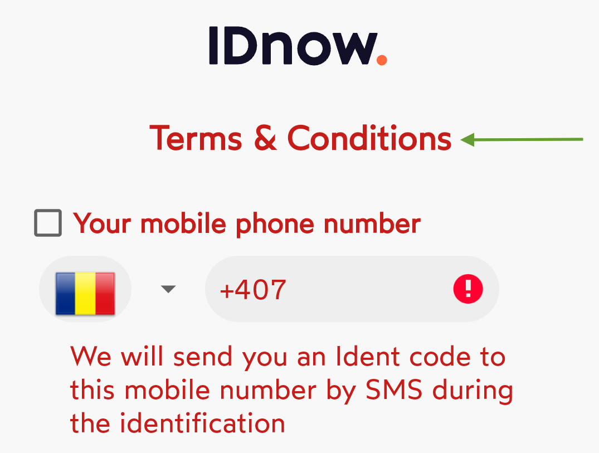
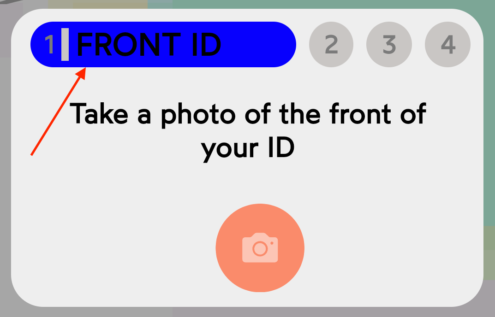
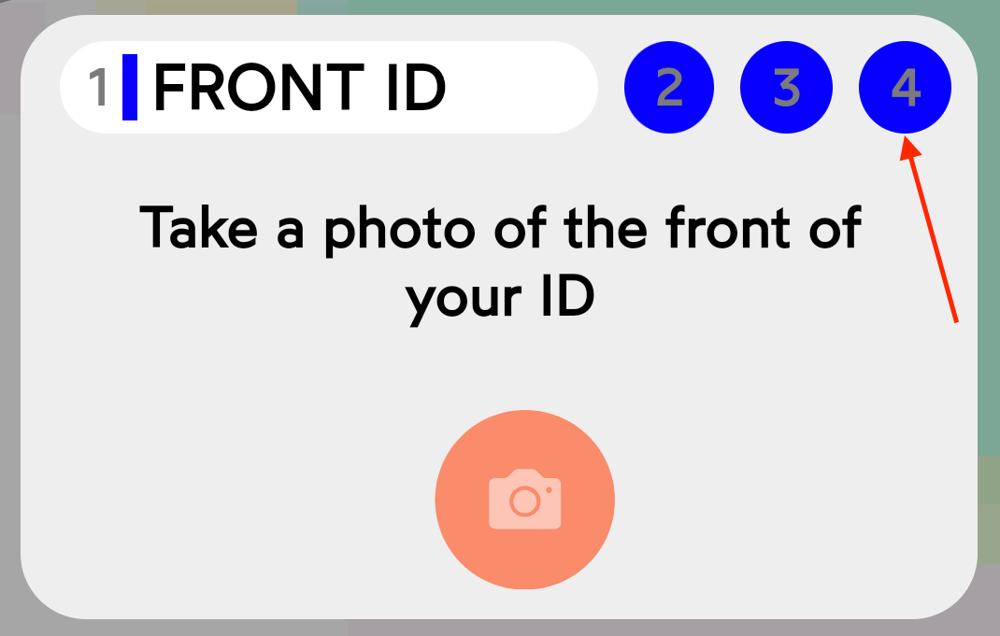

 # Table of Contents
- [Overview](#overview)
    - [VideoIdent](#videoident)
    - [eSign](#esign)
    - [eID](#eid)
- [Requirements](#requirements)
- [Supported Architecture](#supported-architecture)
- [Compatibility, End of Support, End of Life](#compatibility-matrix)
- [Installation](#installation)
    - [Import library](#1-import-library)
    - [Import using Maven](#option-1-maven)
    - [Import using AAR file](#option-2-aar-file)
    - [Import BouncyCastle](#2-import-bouncycastle)
- [Permissions](#permissions)
- [Usage](#usage)
    - [Setup and run](#setup-and-run)
    - [Additional settings](#additional-settings)
    - [Custom certificate providers](#custom-certificate-providers)
        - [DTLS](#dtls)
        - [mTLS](#mtls)
- [Using IDnow with other native libraries (UnsatisfiedLinkError)](#using-idnow-with-other-native-libraries-unsatisfiedlinkerror)
- [Branding](#branding)
    - [Colors](#colors)
    - [Fonts](#fonts)
- [Error codes](#error-codes)
- [Localization](#localization)
- [Environment](#environment)
- [Other Supported Platforms](#other-supported-platforms)
  - [Cordova](#cordova)
  - [React native](#react-native)
- [eID Framework](#eid-framework)
- [Examples](#examples)
   
## Overview

Public API documentation is available [here](https://docs-videoident.idnow.io/?version=latest&_gl=1*rur251*_gcl_aw*R0NMLjE3MzE1OTYwMzkuRUFJYUlRb2JDaE1JZ3UtaDg0bmNpUU1WVXBDREJ4MHkzakJqRUFBWUFTQUFFZ0tPeFBEX0J3RQ..*_gcl_au*MTU1OTcyODAxMS4xNzMxNTk2MDM3#107f6d04-34a7-4ac7-a8b4-e0243b9f4450).

### VideoIdent

IDnow VideoIdent allows to verify the identity of a person along with a verification if the document used is genuine in a process guided by an IDnow Ident Specialist. The user and the IDnow Ident Specialist are interacting with each other during this process using a video-chat.

IDnow offers mobile Apps for iOS and Android for this process. IDnow offers mobile SDKs as well to integrate IDnow VideoIdent into customer-specific mobile apps. IDnow VideoIdent can also be used with a web browser by the user.

### eSign

IDnow eSign issues qualified electronic signatures (QES) on one or more PDF documents. The IDnow eSign product relies on the IDnow VideoIdent technology or the German eID scheme to verify the identity of the person signing the PDF documents.
VideoIdent with eSign is available on mobiles and web browsers; eID with eSign is available on mobiles only.

### eID

German government introduced RFID chip based electronic ID cards in November 2010 and slowly these ID cards have been provided to more and more citizens every year. It is estimated that by end of 2020 all german citizens will possess this new ID card. Usage of this card has been accepted by BSI (Bundesamt für Sicherheit in der Informationstechnik) for digital identification of the citizens.
IDnow eID product is only available on Mobile channel as of now.

## Requirements

- Android Studio;
- Deployment target: Android 6.0 or later;
- In order for end-users to have a seamless experience, the device needs to have the animation capability enabled, otherwise screens that contain animations will not function as intended;
- We are using foreground services in our SDK to perform a task that is required in the process of connecting the end-user with the identification expert, as it is a prerequisite for the video call. 
You’ll need to mention the following foreground service permissions on the App content page (Policy > App content) in Play Console: `FOREGROUND_SERVICE_CAMERA` and `FOREGROUND_SERVICE_MICROPHONE`.

## Supported Architecture

Different Android devices use different CPUs, which in turn support different instruction sets.

Currently we support the following architectures:
- arm64-v8a
- armeabi-v7a.

For further reading: http://developer.android.com/ndk/guides/abis.html.

## Compatibility Matrix

Please refer to the following link to find information about compatibility, end-of-support (EOS) and end-of-life (EOL) dates pertaining to our products: [IDnow Compatibility Matrix: Browser & OS Compatibility guide](https://www.idnow.io/developers/compatibility-overview/)

## Installation

Download the latest version of the [VideoIdent SDK](https://github.com/idnow/de.idnow.android/releases) (see the [changelog]()).

### 1. Import library

#### Option 1: Maven

Add the following repository and dependency to your build.gradle file:

```
allprojects {
    repositories {
        maven("https://raw.githubusercontent.com/idnow/de.idnow.android/master")
    }
} 

dependencies {
    implementation("de.idnow.sdk:idnow-android:x.x.x")
}
```

#### Option 2: AAR file

We also offer the possibility to import the SDK as an .aar file instead.

Copy the `idnow-android-sdk-x.x.x.aar` file into the `libs` folder, then add the following repositories and dependencies to your build.gradle file:

```
allprojects {
    repositories {
        flatDir { dirs("libs") }
    }
}

dependencies {
    implementation(files("libs/idnow-android-sdk-x.x.x.aar"))

    implementation("de.authada.library:aal:4.23.0")
    implementation("de.idnow.insights:idnow-android-insights-sdk:1.2.0")
    implementation("com.google.code.gson:gson:2.8.6")
    implementation("com.squareup.retrofit2:retrofit:2.9.0")
    implementation("com.squareup.retrofit2:converter-gson:2.9.0")
    implementation("com.squareup.okhttp3:okhttp:4.12.0")
    implementation("com.googlecode.libphonenumber:libphonenumber:8.10.9")
    implementation("com.airbnb.android:lottie:5.1.1")
    implementation("com.squareup.okhttp3:logging-interceptor:4.12.0")
} 
```

### 2. Import BouncyCastle

Starting with SDK version 7.0.0 we offer the possibility to integrate your bouncycastle preferred version as an external library.
We offer the BouncyCastle version 1.64 as a default (only compile) used version, therefore integrating it as external library is mandatory for the runtime. 
If you don't have any BouncyCastle version preferences, you can use the following https://github.com/idnow/de.idnow.android-sample/tree/master/app/libs

Copy `bcprov-jdk15to18-164.jar` and `bctls-jdk15to18-164.jar` files into the `libs` folder, then add the following repositories and dependencies to your build.gradle file:

```
allprojects {
    repositories {
        flatDir { dirs("libs") }
    }
}

dependencies {
    implementation(files("libs/bcprov-jdk15to18-164.jar"))
    implementation(files("libs/bctls-jdk15to18-164.jar"))
} 
```

## Permissions

Our SDK uses the following permissions:

```
<uses-permission android:name="android.permission.ACCESS_NETWORK_STATE"/>
<uses-permission android:name="android.permission.INTERNET"/>
<uses-permission android:name="android.permission.WRITE_EXTERNAL_STORAGE"/>
<uses-permission android:name="android.permission.CAMERA" />
<uses-permission android:name="android.permission.FLASHLIGHT" />
<uses-permission android:name="android.permission.BLUETOOTH"/>
<uses-permission android:name="android.permission.BLUETOOTH_ADMIN"/>
<uses-permission android:name="android.permission.BLUETOOTH_CONNECT"/>

//requested when using VideoIdent
<uses-permission android:name="android.permission.MODIFY_AUDIO_SETTINGS" />
<uses-permission android:name="android.permission.RECORD_AUDIO" />

//requested when using eID
<uses-permission android:name="android.permission.NFC" />
```

**Note:** There permissions don't need to be added to your project's manifest file.

## Usage

### Setup and run

After adding the IDnowSDK into your project you need to follow these steps in order to start an identification process.

#### Step 1. Initialize SDK
```
IDnowSDK.getInstance().initialize(<Activity>, "<companyid>");
```

#### Step 2. Start SDK
```
try {
    IDnowSDK.getInstance().initialize(StartActivity.this, "companyId");

    ...
    //Additional settings
    ...

    IDnowSDK.getInstance().start(IDnowSDK.getTransactionToken());
} catch (Exception e) {
    e.printStackTrace();
}
```

The SDK checks the input parameters and throws an Exception if something is deemed not right, to provide you with quick feedback. Handle it as desired.

To handle the results of the identification, implement the standard onActivityResult function in your activity:

```
     @Override
    protected void onActivityResult(int requestCode, int resultCode, Intent data) {
        if (requestCode == IDnowSDK.REQUEST_ID_NOW_SDK) {
            if (resultCode == IDnowSDK.RESULT_CODE_SUCCESS) {
                if (data != null) {
                    String transactionToken = data.getStringExtra(IDnowSDK.RESULT_DATA_TRANSACTION_TOKEN);
                    Log.v(TAG, "success, transaction token: " + transactionToken);
                }
            } else if (resultCode == IDnowSDK.RESULT_CODE_CANCEL) {
                if (data != null) {
                    String transactionToken = data.getStringExtra(IDnowSDK.RESULT_DATA_TRANSACTION_TOKEN);
                    String errorMessage = data.getStringExtra(IDnowSDK.RESULT_DATA_ERROR);
                    Log.v(TAG, "canceled, transaction token: " + transactionToken + ", error: "
                    +errorMessage);
                }
            } else if (resultCode == IDnowSDK.RESULT_CODE_FAILED) {
                if (data != null) {
                    String transactionToken = data.getStringExtra(IDnowSDK.RESULT_DATA_TRANSACTION_TOKEN);
                    String errorMessage = data.getStringExtra(IDnowSDK.RESULT_DATA_ERROR);
                    Log.v(TAG, "failed, transaction token: " + transactionToken + ", error: "
                    +errorMessage);
                }
            } else {
                Log.v(TAG, "Result Code: " + resultCode);
            }
        }
    }

```

### Additional settings

| Property name           | Description       |
| ------------------------- | :----------------------------------------------------------------------------------------------------------------------------------------------------------------------------------------------------------------------------------------------------------------------------------------------------------------------------------------------------------------------------------------------------------------------- |
| setTransactionToken        | A token that will be used for instantiating a video identification.                                                                            | setCompanyId               | Your Company ID provided by IDnow.|
| setEnvironment             | **Optional:** The environment that should be used for the identification (DEV, TEST, LIVE) The default value is `null`. The used environment will then base on the prefix of the transaction token (DEV -> DEV, TST -> Test, else -> Live). You can use the special IDnowEnvironmentCustom to define a custom IDnow installation. If this is done, you need to set the apiHost and websocketHost. |
 setShowErrorSuccessScreen  | **Optional:** If set to `false`, the Error-Success-Screen provided by the SDK will not be displayed. <br />The default value of this property is `true`. |
| setShowVideoOverviewCheck  | **Optional:** If set to `false`, the `Terms and Conditions` screen will not be shown before starting a video identification. <br />The default value of this property is `true`. |
| setApiHost                 | The target server url for REST calls if custom server is used. |
| setWebsocketHost           | The target server url for websocket calls if custom server is used.                                                                                                                                                                                                                                                                                                                                                    |
| setConnectionType          | The connection type to use to talk the backend.`ConnectionType` <br />Possible values:<br />- WEBSOCKET *(default)*<br />- LONG_POLLING                                                                                                                                                                                                                                      |
| setCertificateProvider     | Accepts a subclass of `CertificateProvider`. Used to provide custom mTLS certificates used by the network connections. See [Custom certificate providers](#custom-certificate-providers). |
| setDtlsCertificateProvider | Accepts a subclass of `CertificateProvider`. Used to provide custom DTLS certificates used by the WebRTC connection. See [Custom certificate providers](#custom-certificate-providers).                                                                                                                            
| logging | ```enableLogging``` or ```disableLogging``` methods are used to toggle logging.<br> The default value of this property is `true`. |

### Custom certificate providers

#### DTLS

Starting from SDK version 7.2.0 we offer to set your own DTLS certificates used by the WebRTC connection.
```
IDnowSDK.setDtlsCertificateProvider(certificateProvider);
```    
The certificate provider needs to:
- be a subclass of `CertificateProvider`
- enable  `featureCertificate` flag
- override `provideCertificateBytestream` method (raw data of the certificate file).

#### mTLS

Starting from SDK version 6.5.0 we offer MTLS support for API connections.
 ```
 IDnowSDK.setCertificateProvider(certificateProvider);
 ```    
 The certificate provider needs to:
- be a subclass of `CertificateProvider`
- enable  `featureCertificate` flag
- override `providePrivateKeyBytestream` method (raw data of *.der private key file)
- override `provideCertificateBytestream` method (raw data of .der certificate file)
- enable `featureFingerPrint` and/or `featureServerCert` flag(s)
- override `provideServerFingerPrintByteStreams` and/or `provideServerCertificateBytestreams` method(s) (row data list of fingerprint/certificate files).
 
 **Notes:**
 <br>***- CertificateProvider can validate multiple server certificates/fingerprints.***
 <br>***- Certificates should be imported in .der format.***

## Using IDnow with other native libraries (UnsatisfiedLinkError)

For Videostreaming the Idnow SDK uses IceLink which come with native libs.

If your app uses other 3rd party libs that come with their own native libs, it's possible that you get an UnsatisfiedLinkError.

This means that the native lib folders shipped by your 3rd party lib don't match the native lib folders shipped by the Idnow SDK.
Currently the Idnow SDK comes with the following folders: armeabi-v7a, arm64-v8a.
If your 3rd party lib only supports some of the architectures but not others (e.g. armeabi, but not armeabi-v7a), you have to exclude the other folders of the Idnow SDK in your build.gradle (in this example: armeabi-v7a) with the following command:

```
android {
    packagingOptions {
        exclude "lib/armeabi-v7a/"
    }
}
```

If it's the other way round (your 3rd party lib ships more than armeabi, armeabi-v7a, arm64-v8a), you have to exclude these folders, so the remaining folders match the Idnow SDK folders.

For further reading:
http://developer.android.com/ndk/guides/abis.html
    

Additionally, a video is often required to demonstrate how the app uses the foreground service.

Please contact the support team in case that video is needed. 

## Branding

### Colors

| Parameter Name | Description | Appearance
| -------------- | ----------- | ------------- |
| primaryColor | Optional color that replaces the proceed button background color.<br>Default: <a href="#"></a>#FF6B40 | 
| primaryVariantColor | Optional color that replaces the proceed button background color with a transparent code.<br>Default: <a href="#"></a>#80FF6B40 | 
| bgPrimaryColor | Optional color to be used as the screen background.<br>Default: <a href="#"></a>#F8F8F8 |  
| bgSecondaryColor | Optional color that replaces the default background color of the textfield components.<br>Default: <a href="#"></a>#EEEEEE | 
| primarytextColor | Optional color that replaces the default text color.<br>Default: <a href="#"></a>#000000 <br> Recommendation: Should be some kind of a dark color that does not collide with white color. | 
| buttontextColor | Optional color that replaces the proceed button text color.<br>Default value: <a href="#"></a>#FFFFFF | 
| basicInputField | Optional color that replaces the default text color of the textfield components.<br>Default: <a href="#"></a>#7B7B7B | 
|basicNavStepOn |     Optional color that replaces the default background color for identification steps.<br>Default: <a href="#"></a>#FFFFFF | 
|basicNavStepOff |     Optional color that replaces the default background color for disabled identification steps.<br>Default: <a href="#"></a>#C9C6C4 | 
|||

### Fonts

The SDK offers the possibility to change the font.

Example: 
    
```
  FontsOverride.setDefaultFont(this, "SERIF", "roboto_thin_italic.ttf");
```

## Error codes

| Result code | Description                                                                                              |
| - | - |
| `IDnowSDK.RESULT_CODE_SUCCESS` | Process has successfully finished.<br>Intent contains the identification token (`IDnowSDK.RESULT_DATA_TRANSACTION_TOKEN`) |
| `IDnowSDK.RESULT_CODE_CANCEL` | User has cancelled the identification process.<br>Intent contains the error message (`IDnowSDK.RESULT_DATA_ERROR`) and identification token (`IDnowSDK.RESULT_DATA_TRANSACTION_TOKEN`) |
| `IDnowSDK.RESULT_CODE_FAILED` | The identification has failed.<br>Intent contains the error code (`IDnowSDK.RESULT_ERROR_CODE`) and/or message (`IDnowSDK.RESULT_DATA_ERROR`)  |
| `IDnowSDK.RESULT_CODE_WRONG_IDENT` | User has used a wrong identification token.<br>Intent contains the error message (`IDnowSDK.RESULT_DATA_ERROR`) and identification token (`IDnowSDK.RESULT_DATA_TRANSACTION_TOKEN`) |
|||

## Localization

In case you would like to change the localization used by the IDnow SDK at runtime you can do it by supplying the language code to the IDnowSettings instance.

Supported values are: en (English), de (German), fr (French), es (Spanish), it (Italian), pt (Portuguese), et (Estonian), hr (Croatian), hu (Hungarian), ka (Georgian), ko(Korean), lt(Lithuanian), lv (Latvian), nl (Dutch), pl (Polish), ua (Ukrainian), zh (Chinese), ru (Russian).

```
IDnowSDK.setLocale(context, "en");
```

## Environment

To configure the environment used for the identification process, you can set a specific environment value. If no environment is defined, the default value is ```null```, which means that it will be automatically determined based on the prefix of the transaction token.

Available environments:
<br>- ```DEV``` → Development environments (```DEV```, ```DEV2```, ```DV3```, ..., ```DV20```);
<br>- ```TEST``` → Test environments (```TEST```, ```TEST1```, ```TEST2```, ```TEST3```);
<br>- ```STAGING``` → Staging environment (```SG1```);
<br>- ```LIVE``` → Production environment (```LIVE```);
<br>- ```CUSTOM``` → Custom environment (```CUSTOM```).

Example:
```
IDnowSDK.setEnvironment(IDnowSDK.Server.DEV);
```
<br>If you want to use a custom environment, you need to configure the following properties to establish the connection to the custom servers:
<br>- API Host
<br>- WebSocket Host
<br>- Video Host
<br>- STUN Host

Example:
```
IDnowSDK.setApiHost("YOUR_API_HOST", context);
IDnowSDK.setWebsocketHost("YOUR_WEBSOCKET_HOST", context);
IDnowSDK.setVideoHost("YOUR_VIDE_HOST", context);
IDnowSDK.setStunHost("YOUR_STUN_HOST", context);
```

## Other supported platforms

### Cordova

Our Cordova plugin offers the possibility of integrating our native Android and iOS SDK into the Cordova-based applications. The plugin offers the possibility to customize and setup of the SDK. At the end of the identification process, the SDK communicates with the plug-in via a callback, allowing the Cordova application to update the flow.
Please refer to this [link](https://www.npmjs.com/package/com-idnow-plugin) for implementation details.\
**Note**: Only VideoIdent and eSign are supported so far. eID is not supported.

### React native

Our React Native plug-in offers the possibility of integrating our native Android and iOS SDK into the React Native-based applications. It offers the possibility to customize and setup the SDK, and uses the latest expo native modules to create the bridging mechanism.
Please refer to this [link](https://www.npmjs.com/package/react-native-vi-idnow-library) for implementation details.\
**Note**: Only VideoIdent and eSign are supported so far. eID is not supported.

## eID Framework

IDnow eID is an automated and fully AML-compliant identification product. All it requires is an NFC-enabled (Near Field Communication) smartphone and a German ID document (ID card or Residence permit) with an activated eID function or the eID card for EU citizens.

For configuration details, please refer to the [IDnow eID SDK Documentation](./de/idnow/android/eid/README.md)

## Examples

Please see https://github.com/idnow/de.idnow.android-sample for a sample applications.
