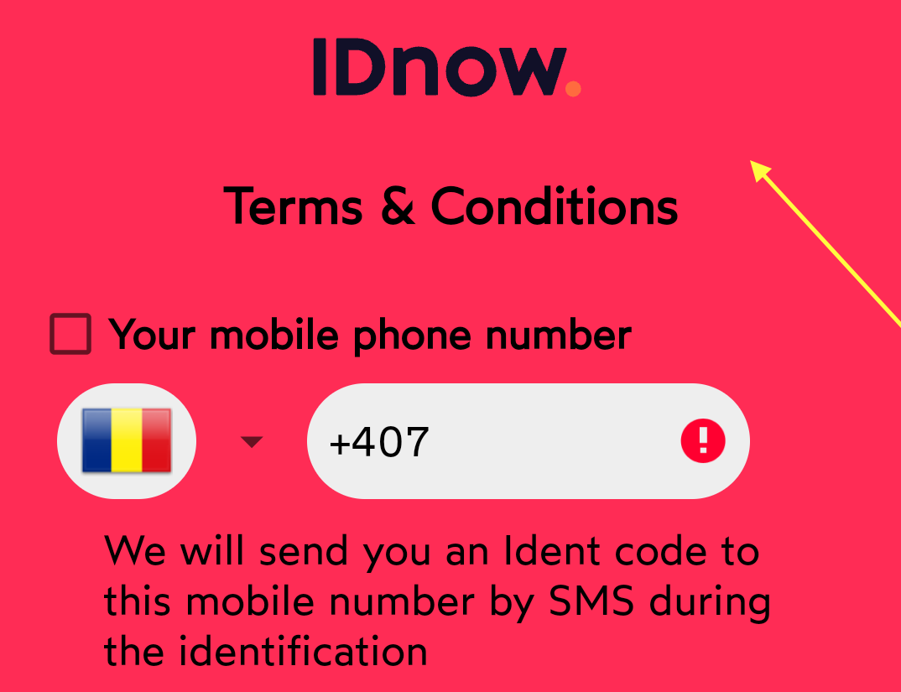
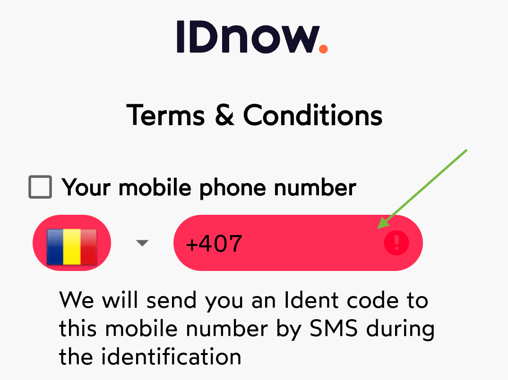
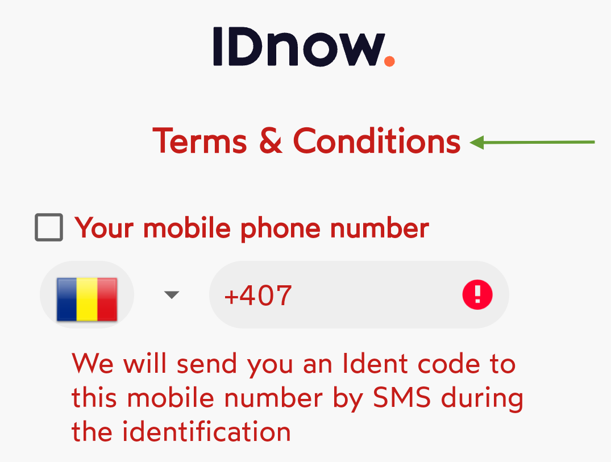
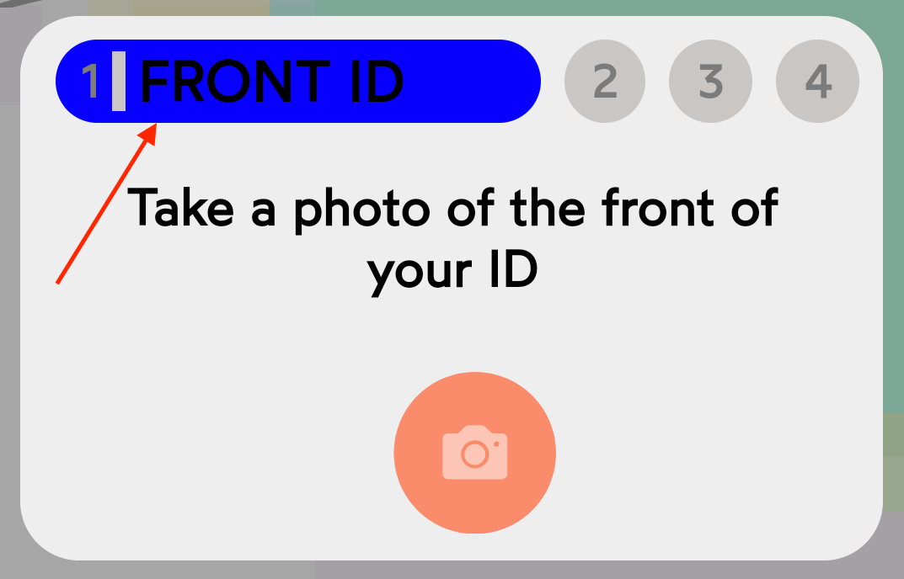
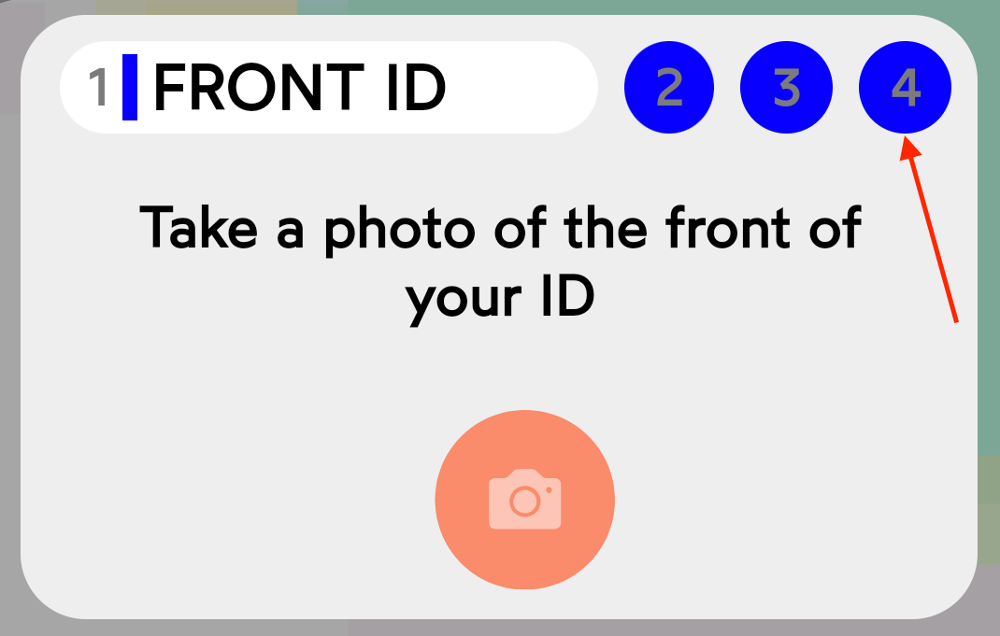

# VI and eID SDK

## Table of Contents
- [Table of Contents](#table-of-contents)
  - [Overview](#overview)
    - [Purpose and audience](#purpose-and-audience)
    - [Applicability](#applicability)
    - [VideoIdent](#videoident)
    - [eSign](#esign)
    - [eID](#eid)
  - [Requirements](#requirements)
  - [Supported Architecture](#supported-architecture)
  - [Compatibility Matrix](#compatibility-matrix)
  - [Installation](#installation)
    - [Import library](#import-library)
      - [Option 1: Maven](#option-1-maven)
      - [Option 2: AAR file](#option-2-aar-file)
  - [Permissions](#permissions)
  - [Usage](#usage)
    - [Setup and run](#setup-and-run)
    - [Retrieve result from the SDK](#retrieve-result-from-the-sdk)
    - [Additional settings](#additional-settings)
    - [Custom certificate providers](#custom-certificate-providers)
      - [DTLS](#dtls)
      - [mTLS](#mtls)
  - [Native libraries conflict (UnsatisfiedLinkError)](#native-libraries-conflict-unsatisfiedlinkerror)
  - [Branding](#branding)
    - [Overriding SDK colors in your app](#overriding-sdk-colors-in-your-app)
      - [Example (default / light theme)](#example-default--light-theme)
      - [Example (dark theme)](#example-dark-theme)
    - [Colors](#colors)
    - [Fonts](#fonts)
  - [Result codes](#result-codes)
    - [Error codes](#error-codes)
    - [Handling user cancelation](#handling-user-cancelation)
      - [Possible cancelation steps](#possible-cancelation-steps)
  - [Localization](#localization)
  - [Environment](#environment)
  - [Other supported platforms](#other-supported-platforms)
    - [React native](#react-native)
  - [eID Framework](#eid-framework)
  - [Examples](#examples)
   
## Overview

Public API documentation is available [here](https://docs-videoident.idnow.io/?version=latest&_gl=1*rur251*_gcl_aw*R0NMLjE3MzE1OTYwMzkuRUFJYUlRb2JDaE1JZ3UtaDg0bmNpUU1WVXBDREJ4MHkzakJqRUFBWUFTQUFFZ0tPeFBEX0J3RQ..*_gcl_au*MTU1OTcyODAxMS4xNzMxNTk2MDM3#107f6d04-34a7-4ac7-a8b4-e0243b9f4450).

### Purpose and audience

This guide is designed for developers integrating IDnow SDKs into mobile applications. The guide focuses on simplifying the integration process through clear instructions and practical examples.


### Applicability

This guide covers VideoIdent (VI), eSign, and eID SDKs.

[React native](#react-native) plugin is available for the complete solution.


### VideoIdent

IDnow VideoIdent verifies the identity of a person. The user must submit an accepted ID document, which is verified along with ID holder or user in a process guided by an IDnow Ident Specialist. The user and the IDnow Ident Specialist interact with each other during this process using a video-chat.

IDnow offers mobile Apps for iOS and Android. Customers can use IDnow mobile SDKs to integrate VideoIdent into customer-specific mobile apps. VideoIdent can also be used with a web browser by the user.

### eSign

IDnow eSign issues Qualified Electronic Signatures (QES) on one or more PDF documents. The IDnow eSign product relies on the IDnow’s VideoIdent application or the German eID technology to verify the identity of the person signing the PDF documents. VideoIdent with eSign is available on mobiles and web browsers; eID with eSign is available on mobiles only.

### eID

German government introduced RFID chip based electronic ID cards in November 2010. Usage of this card has been accepted by BSI (Bundesamt für Sicherheit in der Informationstechnik) for digital identification of the citizens. IDnow eID product is only available on the mobile channel as of now.

## Requirements
- Android Studio;
- Deployment target: Android 9.0 (API level 28) or higher for eID with Governikus or Android 8.0 (API level 26) for VI, eSign and eID with Authada
- The user’s device must have animation capability to have a seamless experience, otherwise screens that contain animations will not function as intended;
- We are using foreground services in our SDK to perform a task that is required in the process of connecting the end-user with the identification expert, as it is a prerequisite for the video call. 
You’ll need to mention the following foreground service permissions on the App content page (Policy > App content) in Play Console: `FOREGROUND_SERVICE_CAMERA` and `FOREGROUND_SERVICE_MICROPHONE`.
Additionally, a video is often required to demonstrate how the app uses the foreground service.
Please contact the support team in case that video is needed.

## Supported Architecture

Different Android devices use different CPUs, which in turn support different instruction sets.

Currently, we support the following architectures:
- arm64-v8a
- armeabi-v7a.

For further reading: http://developer.android.com/ndk/guides/abis.html.

## Compatibility Matrix

Please refer to the following link to find information about compatibility, end-of-support (EOS) and end-of-life (EOL) dates pertaining to our products: [IDnow Compatibility Matrix: Browser & OS Compatibility guide](https://www.idnow.io/developers/compatibility-overview/)

## Installation

Download the latest version of the [VideoIdent SDK](https://github.com/idnow/de.idnow.android/releases) (see the [changelog](./CHANGELOG.md)).

### Import library

#### Option 1: Maven

Add the following repository and dependency to your build.gradle file:

```
allprojects {
    repositories {
        maven("https://raw.githubusercontent.com/idnow/de.idnow.android/master")
        //needed if eID with Authada
        maven {
            url = uri("https://repo.authada.de/public/")
            authentication {
                basic(BasicAuthentication)
            }
            credentials {
                username "*********"
                password "*********"
            }
        }
    }
} 

dependencies {
    // VI & eSign
    implementation("de.idnow.sdk:idnow-android-sdk:x.x.x")
    
    //eID
    implementation("de.idnow.android.eid:idnow-android-eid-sdk:x.x.x")
    
    //Additional dependencies needed
    
    //BouncyCastle: use the one adapted to the jdk you are using
    implementation ("org.bouncycastle:bcprov-jdk15to18:1.83")
    implementation ("org.bouncycastle:bctls-jdk15to18:1.83")
    implementation ("org.bouncycastle:bcutil-jdk15to18:1.83")
    
    //For eID with Governikus
    implementation ("com.governikus:ausweisapp:2.4.1")
    
    //For eID with Authada (ask for maven credentials)
    implementation group: 'de.authada.library', name: 'aal', version: '4.24.4'
    
}
```

#### Option 2: AAR file

We also offer the possibility to import the SDKs as an .aar file instead.
You can download it from this repository inside the package de.idnow.android.eid for eID
and inside de.idnow.sdk for VideoIdent

## Permissions

Our SDK uses the following permissions:

```
<uses-permission android:name="android.permission.INTERNET"/>
<uses-permission android:name="android.permission.ACCESS_NETWORK_STATE"/>
<uses-permission android:name="android.permission.READ_EXTERNAL_STORAGE" />
<uses-permission android:name="android.permission.WRITE_EXTERNAL_STORAGE"/>
<uses-permission android:name="android.permission.ACTION_MANAGE_ALL_FILES_ACCESS_PERMISSION" />
<uses-permission android:name="android.permission.CAMERA" />
<uses-permission android:name="android.permission.FLASHLIGHT" />
<uses-permission android:name="android.permission.BLUETOOTH"/>
<uses-permission android:name="android.permission.BLUETOOTH_ADMIN"/>
<uses-permission android:name="android.permission.BLUETOOTH_CONNECT"/>
<uses-permission android:name="android.permission.RECORD_AUDIO" />
<uses-permission android:name="android.permission.MODIFY_AUDIO_SETTINGS" />
<uses-permission android:name="android.permission.FOREGROUND_SERVICE" />
<uses-permission android:name="android.permission.FOREGROUND_SERVICE_MICROPHONE" />
<uses-permission android:name="android.permission.FOREGROUND_SERVICE_CAMERA" />
//requested when using eID
<uses-permission android:name="android.permission.NFC" />
```

__Note:__ These permissions don't need to be added to your project's manifest file.

## Usage

### Setup and run

After adding the IDnowSDK into your project you can start the identification process like this.

```
try {
    IDnowSDK.getInstance().initialize(StartActivity.this);

    ...
    //Additional settings
    ...

    IDnowSDK.getInstance().start(IDnowSDK.getTransactionToken());
} catch (Exception e) {
    e.printStackTrace();
}
```

### Retrieve result from the SDK
To handle the results of the identification, implement the standard onActivityResult function in your activity:

```java
    @Override
    void onActivityResult(int requestCode, int resultCode, Intent data) {
        if (requestCode == IDnowSDK.REQUEST_ID_NOW_SDK) {
            if (resultCode == IDnowSDK.RESULT_CODE_SUCCESS) {
                if (data != null) {
                    String transactionToken = data.getStringExtra(IDnowSDK.RESULT_DATA_TRANSACTION_TOKEN);
                    Log.v(TAG, "success, transaction token: " + transactionToken);
                }
            } else if (resultCode == IDnowSDK.RESULT_CODE_CANCEL) {
                if (data != null) {
                    String transactionToken = data.getStringExtra(IDnowSDK.RESULT_DATA_TRANSACTION_TOKEN);
                    String errorMessage = data.getStringExtra(IDnowSDK.RESULT_DATA_ERROR);
                    String cancelationStep = data.getStringExtra(IDnowSDK.RESULT_CANCEL_STEP);
                    Log.v(TAG, "Canceled, transaction token: " + transactionToken + ", error: "
                        + errorMessage + " Cancelation step: " + cancelationStep );
                }
            } else if (resultCode == IDnowSDK.RESULT_CODE_FAILED) {
                if (data != null) {
                    String transactionToken = data.getStringExtra(IDnowSDK.RESULT_DATA_TRANSACTION_TOKEN);
                    String errorMessage = data.getStringExtra(IDnowSDK.RESULT_DATA_ERROR);
                    Log.v(TAG, "failed, transaction token: " + transactionToken + ", error: "
                    +errorMessage);
                }
            } else if (resultCode == IDnowSDK.RESULT_USER_IN_QUEUE) {
                Log.v(TAG, "User enrolled into the waiting list and will be notified via SMS ");
            } else {
                Log.v(TAG, "Result Code: " + resultCode);
            }
        }
    }

```

### Additional settings

| Property name              | Description                                                                                                                                                                                                                                                                                                                                                                                                                   |
|----------------------------|:------------------------------------------------------------------------------------------------------------------------------------------------------------------------------------------------------------------------------------------------------------------------------------------------------------------------------------------------------------------------------------------------------------------------------|
| setTransactionToken        | A token that will be used for instantiating a video identification.                                                                                                                                                                                                                                                                                                                                                           |
| setCompanyId               | Your Company ID provided by IDnow.                                                                                                                                                                                                                                                                                                                                                                                            |
| setEnvironment             | **Optional:** There are three types of environment that can be used for the identification. They are: DEV, TEST, LIVE. The default value is `null`. The  environment used is identified by the prefix of the transaction token (DEV -> DEV, TST -> Test, else -> Live). You can use the special IDnowEnvironmentCustom to define a custom IDnow installation. If this is done, you need to set the apiHost and websocketHost. |
| setShowErrorSuccessScreen  | **Optional:** If set to `false`, the Error-Success-Screen provided by the SDK will not be displayed. <br />The default value of this property is `true`.                                                                                                                                                                                                                                                                      |
| setShowVideoOverviewCheck  | **Optional:** If set to `false`, the `Terms and Conditions` screen will not be shown before starting a video identification. <br />The default value of this property is `true`.                                                                                                                                                                                                                                              |
| setApiHost                 | The target server url for REST calls if custom server is used.                                                                                                                                                                                                                                                                                                                                                                |
| setWebsocketHost           | The target server url for websocket calls if custom server is used.                                                                                                                                                                                                                                                                                                                                                           |
| setConnectionType          | The connection type to use to talk to the backend.`ConnectionType` <br />Possible values:<br />- WEBSOCKET *(default)*<br />- LONG_POLLING                                                                                                                                                                                                                                                                                    |
| setCertificateProvider     | Accepts a subclass of `CertificateProvider`. Used to provide custom mTLS certificates used by the network connections. See [Custom certificate providers](#custom-certificate-providers).                                                                                                                                                                                                                                     |
| setDtlsCertificateProvider | Accepts a subclass of `CertificateProvider`. Used to provide custom DTLS certificates used by the WebRTC connection. See [Custom certificate providers](#custom-certificate-providers).                                                                                                                                                                                                                                       |
| logging                    | ```enableLogging``` or ```disableLogging``` methods are used to toggle logging.<br> The default value of this property is `true`.                                                                                                                                                                                                                                                                                             |

### Custom certificate providers

#### DTLS

Starting from SDK version 7.2.0 we offer to set your own DTLS certificates used by the WebRTC connection.
```
IDnowSDK.setDtlsCertificateProvider(certificateProvider);
```    
The certificate provider needs to:
- be a subclass of `CertificateProvider`
- enable  `featureCertificate` flag
- override `provideCertificateBytestream` method (raw data of the certificate file).

#### mTLS

Starting from SDK version 6.5.0 we offer MTLS support for API connections.
 ```
 IDnowSDK.setCertificateProvider(certificateProvider);
 ```    
 The certificate provider needs to:
- be a subclass of `CertificateProvider`
- enable  `featureCertificate` flag
- override `providePrivateKeyBytestream` method (raw data of *.der private key file)
- override `provideCertificateBytestream` method (raw data of .der certificate file)
- enable `featureFingerPrint` and/or `featureServerCert` flag(s)
- override `provideServerFingerPrintByteStreams` and/or `provideServerCertificateBytestreams` method(s) (raw data list of fingerprint/certificate files).
 
 **Notes:**
 <br>***- CertificateProvider can validate multiple server certificates/fingerprints.***
 <br>***- Certificates should be imported in .der format.***

## Native libraries conflict (UnsatisfiedLinkError)

For Videostreaming the IDnow SDK uses LiveSwitch which come with native libs.

If your app uses other 3rd party libs that come with their own native libs, it's possible that you get an UnsatisfiedLinkError.

This means that the native lib folders shipped by your 3rd party lib don't match the native lib folders shipped by the IDnow SDK.
Currently the IDnow SDK comes with the following folders: armeabi-v7a, arm64-v8a.
If your 3rd party library only supports some of the architectures but not others (e.g. armeabi, but not armeabi-v7a), you must exclude the other folders of the IDnow SDK in your build.gradle (in this example: armeabi-v7a) with the following command:

```
android {
    packagingOptions {
        exclude "lib/armeabi-v7a/"
    }
}
```

If it's the other way round (your 3rd party lib ships more than armeabi, armeabi-v7a, arm64-v8a), you have to exclude these folders, so the remaining folders match the Idnow SDK folders.

For further reading:
http://developer.android.com/ndk/guides/abis.html

## Branding

### Overriding SDK colors in your app

1. In your app module, open or create:
   - `app/src/main/res/values/colors.xml` (default theme)
   - `app/src/main/res/values-night/colors.xml` (dark theme, if used)
2. For each parameter from the table below that you want to customize, declare a color with the **same name** in your app’s `colors.xml`. When names match, your app value overrides the SDK default via Android’s resource merging.

#### Example (default / light theme)
```xml
    <!-- app/src/main/res/values/colors.xml -->
    <resources>
        <!-- Override SDK colors -->
        <color name="primaryColor">#123456</color>
        <color name="bgPrimaryColor">#F5F5F5</color>
        <color name="buttontextColor">#FFFFFF</color>
    </resources>
```

#### Example (dark theme)
```xml
    <!-- app/src/main/res/values-night/colors.xml -->
    <resources>
        <color name="primaryColor">#FF6B40</color>
        <color name="bgPrimaryColor">#121212</color>
    </resources>
```

### Colors

| Parameter Name      | Description                                                                                                                                                                                                                                                                | Appearance                                                    |
|---------------------|----------------------------------------------------------------------------------------------------------------------------------------------------------------------------------------------------------------------------------------------------------------------------|---------------------------------------------------------------|
| primaryColor        | Optional color that replaces the background color of the Proceed button.<br>Default: <a href="#"></a>#FF6B40                                                               |         |
| primaryVariantColor | Optional color that replaces the background color of the Proceed button with a transparent code.<br>Default: <a href="#"></a>#80FF6B40                                 |  |
| bgPrimaryColor      | Optional color to be used as the screen background.<br>Default: <a href="#"></a>#F8F8F8                                                                                    |       |
| bgSecondaryColor    | Optional color that replaces the default background color of the textfield components.<br>Default: <a href="#"></a>#EEEEEE                                                 |     |
| primarytextColor    | Optional color that replaces the default text color.<br>Default: <a href="#"></a>#000000 <br> Recommendation: It must be a dark color that contrasts with the white color. |     |
| buttontextColor     | Optional color that replaces the color of the text in the Proceed button.<br>Default value: <a href="#"></a>#FFFFFF                                                        |      |
| basicInputField     | Optional color that replaces the default text color of the textfield components.<br>Default: <a href="#"></a>#7B7B7B                                                       |      |
| basicNavStepOn      | Optional color that replaces the default background color of the identification steps when this parameter is activated.<br>Default: <a href="#"></a>#FFFFFF                |       |
| basicNavStepOff     | Optional color that replaces the default background color for disabled identification steps when the parameter is deactivated.<br>Default: <a href="#"></a>#C9C6C4         |      |


### Fonts

The SDK offers the possibility to change the font.

Example: 
    
```
  FontsOverride.setDefaultFont(this, "SERIF", "roboto_thin_italic.ttf");
```

## Result codes

| Result code | Description                                                                                                                                                                                                                               |
| - |-------------------------------------------------------------------------------------------------------------------------------------------------------------------------------------------------------------------------------------------|
| `IDnowSDK.RESULT_CODE_SUCCESS` | Process has successfully finished.<br>Intent contains the identification token (`IDnowSDK.RESULT_DATA_TRANSACTION_TOKEN`)                                                                                                                 |
| `IDnowSDK.RESULT_CODE_CANCEL` | User has cancelled the identification process.<br>Intent contains the error message (`IDnowSDK.RESULT_DATA_ERROR`), identification token (`IDnowSDK.RESULT_DATA_TRANSACTION_TOKEN`)  and cancelation step (`IDnowSDK.RESULT_CANCEL_STEP`) |
| `IDnowSDK.RESULT_CODE_FAILED` | The identification has failed.<br>Intent contains the error code (`IDnowSDK.RESULT_ERROR_CODE`) and a message describing the issue (`IDnowSDK.RESULT_DATA_ERROR`). The possible error codes are listed [below](#error-codes)              |
| `IDnowSDK.RESULT_CODE_WRONG_IDENT` | User has used a wrong identification token.<br>Intent contains the error message (`IDnowSDK.RESULT_DATA_ERROR`) and identification token (`IDnowSDK.RESULT_DATA_TRANSACTION_TOKEN`)                                                       |
| `IDnowSDK.RESULT_USER_IN_QUEUE` | User has enrolled into the waiting list and will resume the identification once notified via an SMS. Current identification session is finished.                                                                                          |


### Error codes
The error codes are sent as a part of the failed identification and can be retrieved in the following way:
```kotlin
val errorCode = data.getSerializableExtra(IDnowSDK.RESULT_ERROR_CODE) as IDnowErrorCode
```

| Error Code | Description |
| --- | --- |
| `IDnowErrorMissingTransactionToken` | Occurs when the correct transaction token was not supplied to the SDK during the initialization. |
| `IDnowErrorOfficeClosed` | Occurs when an identification cannot be initialized because the time is outside business hours. |
| `IDnowErrorUnsupportedDevice` | The identification can't be performed because the device does not meet the requirements. |
| `IDnowErrorCameraAccessNotGranted` | Occurs when a video ident was requested, but the camera access was not granted by the user. |
| `IDnowErrorMicrophoneAccessNotGranted` | Occurs when a video ident was requested, but the microphone access was not granted by the user. |
| `IDnowErrorNoInternetConnection` | Occurs when a video ident was requested, but no internet connection is present. |
| `IDnowErrorServer` | Can occur at any stage during a communication with the server. Additionally, the resulting data will contain the HTTP response status code that can be retrieved in the following way: `data.getIntExtra(IDnowSDK.RESULT_SERVER_STATUS_CODE, 0)` |
| `IDnowErrorWebRTC` | Can occur during an identification process (e.g. WebRTC service could not establish a video connection). |
| `IDnowErrorIdentificationFailed` | The identification process was finished but the identity verification was not successful. |
| `IDnowErrorHighCallVolumeTryLater` | User agreed to try the identification later due to the high call volume. |
| `IDnowErrorTokenNotSupported` | The token used for this identification is meant for another product. |
| `IDnowErrorTokenNotSupported_eIDStandalone` | eID standalone tokens cannot be used if the eID SDK is not added to the project. Please follow the [installation steps](./README.md#installation) to setup the eID library. |
| `IDnowErrorUnsupportedProduct` | The product for this token is no longer supported. |
| `IDnowErrorUnsupportedBluetoothHeadset` | Bluetooth headset was used despite being disabled in the configuration. |
| `IDnowInstantSignDocumentExpired` | Instant Sign operation rejected, the trusted document is expired. This document is no longer valid. |

### Handling user cancelation

When the user cancels a VideoIdent+ identification, the SDK reports *where* in the flow the cancelation happened in the intent with the result code `RESULT_CODE_CANCEL` via the extra  `IDnowSDK.RESULT_CANCEL_STEP`.
Example to retrieve the cancelation step [here](#retrieve-result-from-the-sdk)

#### Possible cancelation steps

| Value | Screen the user canceled on |
| --- | --- |
| `LANGUAGE_SELECTION` | The agent language selection screen. |
| `CONSENT` | The `Terms and Conditions` / consent screen shown before the identification starts. |
| `CALL_QUALITY_CHECK` | The call quality check performed before connecting to an agent. |
| `INSTRUCTIONS` | The instructions screen shown before starting the video call. |
| `HIGH_CALL_VOLUME` | The high call volume screen offering the user to try again later. |
| `WAITING_ROOM` | The waiting screen shown while the user waits to be served. |
| `WAITING_LIST` | The waiting list screen offering the user to be notified via SMS. |
| `WAITING_FOR_AGENT` | The video call is established, but no agent has joined the conversation yet. |
| `AGENT_CONVERSATION` | The video conversation with the IDnow Ident Specialist is in progress. |
| `DOCUMENT_CLASSIFICATION` | The manual document capture / classification step. |
| `NAME_VERIFICATION` | The name verification screen. |

__Note:__ These string values are a stable public contract and will not be renamed. New values may be added when new screens are introduced to the flow, so handle unknown values gracefully.


## Localization

In case you would like to change the localization used by the IDnow SDK at runtime you can do it by supplying the language code to the IDnowSettings instance. The languages supported are mentioned below:

| Language | Code                                                                                              |
| - | - |
| English | en |
| German | de |
| French | fr |
| Spanish | es |
| Italian | it |
| Portuguese | pt |
| Estonian | et |
| Croatian | hr |
| Hungarian | hu |
| Georgian | ka |
| Korean | ko |
| Lithuanian | lt |
| Latvian | lv |
| Dutch | nl |
| Polish | pl |
| Ukrainian | ua |
| Chinese | zh |
| Russian | ru |

For example, if you want to change language to English(en) then follow this setting:

```
IDnowSDK.setLocale(context, "en");
```

## Environment

To configure the environment used for the identification process, you can set a specific environment value. If no environment is defined, the default value is ```null```, which means that it will be automatically determined based on the prefix of the transaction token.

Available environments:
<br>- ```DEV``` → Development environments (```DEV```, ```DEV2```, ```DV3```, ..., ```DV20```);
<br>- ```TEST``` → Test environments (```TEST```, ```TEST1```, ```TEST2```, ```TEST3```);
<br>- ```STAGING``` → Staging environment (```SG1```);
<br>- ```LIVE``` → Production environment (```LIVE```);
<br>- ```CUSTOM``` → Custom environment (```CUSTOM```).

Example: If Development environment is required, then user must initialize the following setting, otherwise it will be set depending on the identification token used.
```
IDnowSDK.setEnvironment(IDnowSDK.Server.DEV);
```
<br>If you want to use a custom environment, you need to configure the following properties to establish the connection to the custom servers:
| Name | Description | 
| --- | --- |
| API Host | The domain name or IP address (IPv4) of the host that serves the API. |
| WebSocket Host | A WebSocket server that listens to WebSocket connections or channels and handles the communication with clients trying to connect to it. |
| Video Host | The server that hosts and displays online video. |
| STUN Host | A STUN (Session Traversal Utilities for NAT) host sends a request to a STUN server, which is located on the public side of the Network Address Translation (NAT). The server responds with the public IP address and port from which the request was seen. |

Example:
```
IDnowSDK.setApiHost("YOUR_API_HOST", context);
IDnowSDK.setWebsocketHost("YOUR_WEBSOCKET_HOST", context);
IDnowSDK.setVideoHost("YOUR_VIDEO_HOST", context);
IDnowSDK.setStunHost("YOUR_STUN_HOST", context);
```

## Other supported platforms
### React native

Our React Native plug-in offers the possibility of integrating our native Android and iOS SDK into the React Native-based applications. It offers the possibility to customize and setup the SDK, and uses the latest expo native modules to create the bridging mechanism.
-  [VI Plugin](https://www.npmjs.com/package/@idnow/react-videoident)
-  [eID Plugin](https://www.npmjs.com/package/@idnow/react-eid?activeTab=readme)

## eID Framework

IDnow eID is an automated and fully AML-compliant identification product. All it requires is an NFC-enabled (Near Field Communication) smartphone and a German ID document (ID card or Residence permit) with an activated eID function or the eID card for EU citizens.

For configuration details, please refer to the [IDnow eID SDK Documentation](./de/idnow/android/eid/README.md)

## Examples

Please see https://github.com/idnow/de.idnow.android-sample for a sample application.
