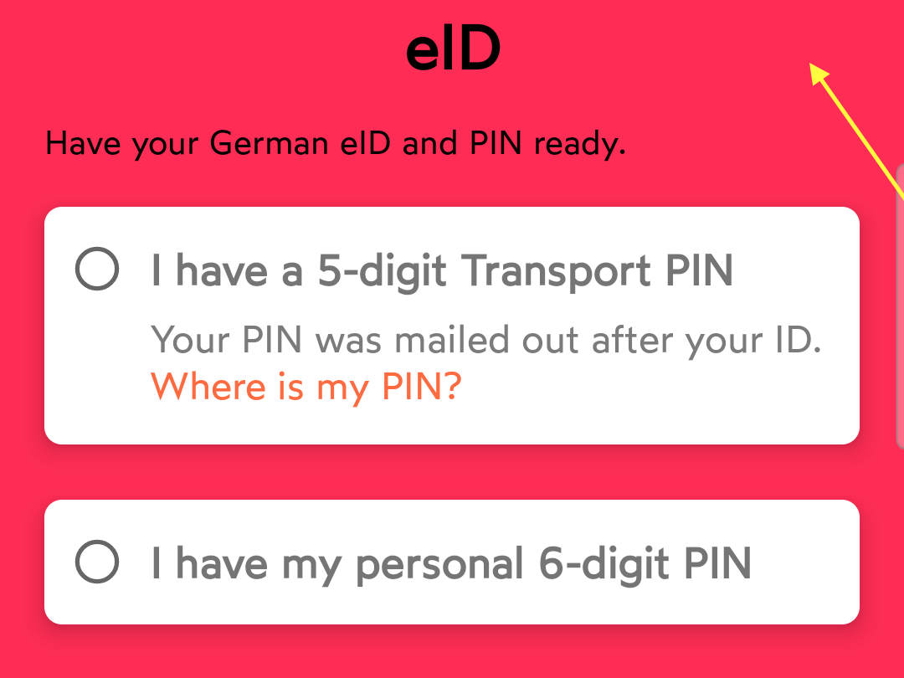
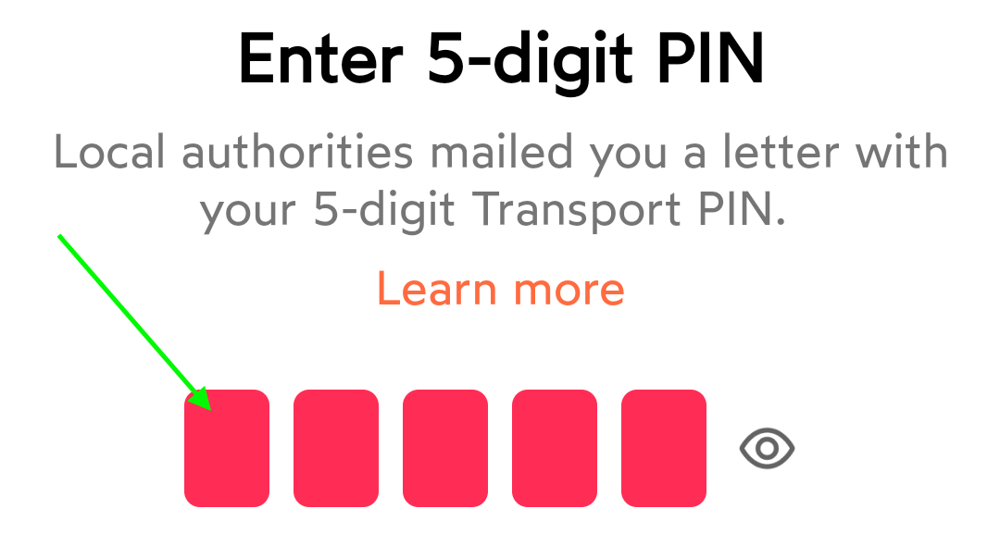
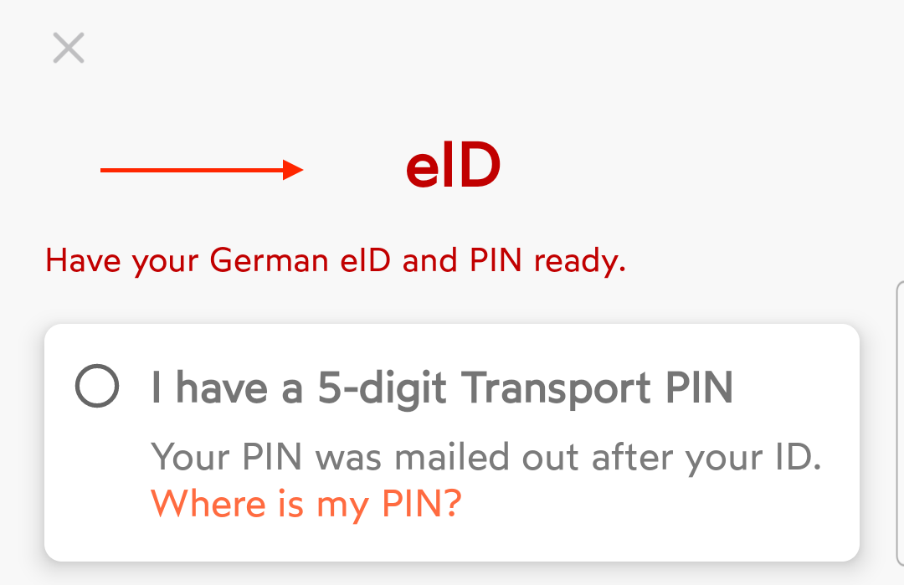
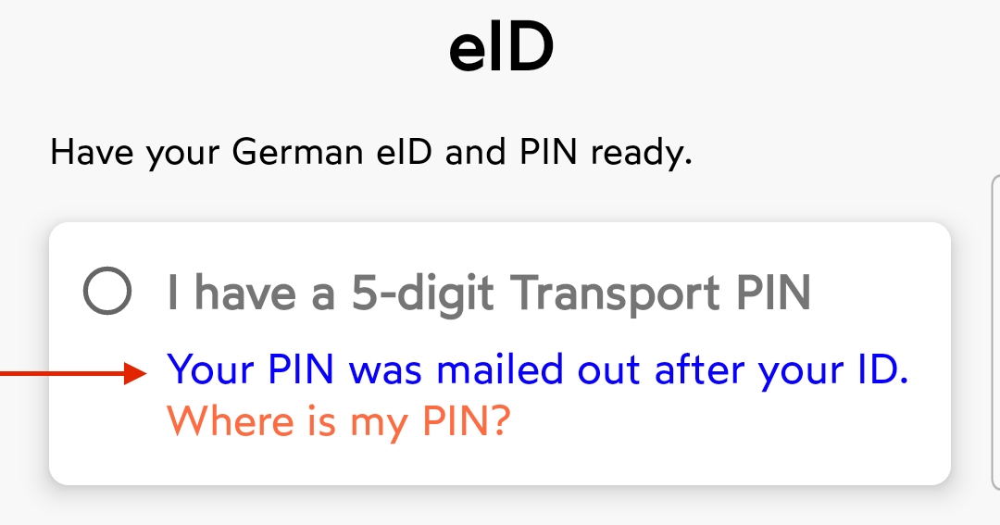
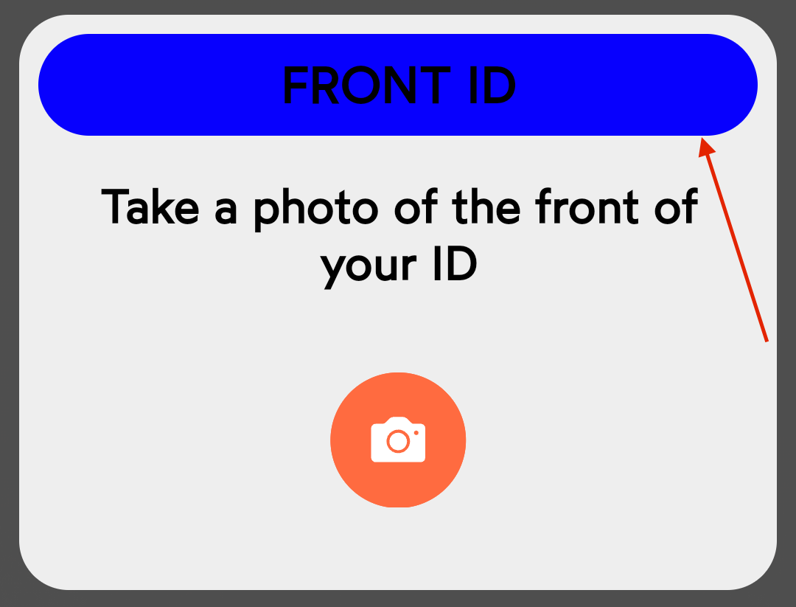
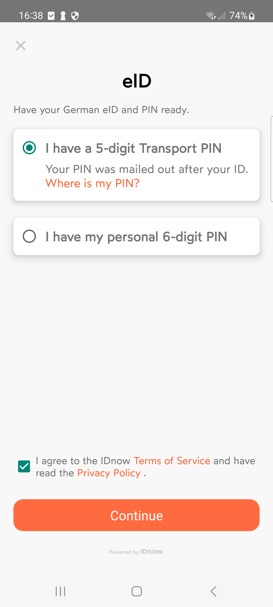
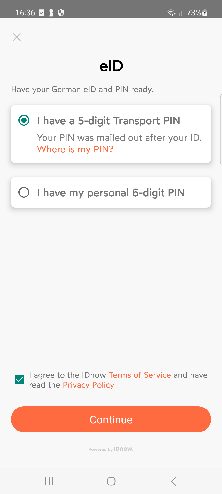

# IDnow eID SDK

<b>IDnow eID feature is a seperate module in Video Ident Product.</b>

## Table of Contents

- [Requirements](#requirements)
- [Installation](#installation)
    - [Host app configuration](#host-app-configuration)
        - [Import using Maven](#option-1-maven)
        - [Import using AAR file](#option-2-aar-file)
    - [Usage](#usage)
- [Error codes](#error-codes)
- [Branding](#branding)
    - [Colors](#colors)
    - [Configuration](#configuration)
      - [Terms and conditions](#enabletnc)


## Requirements

- Android Studio
- Deployment target: Android 6.0 or later (<b>NFC</b> is required)


## Installation

Download the latest version of the [eID framework](https://github.com/idnow/de.idnow.android/releases).

### Host App configuration

#### Step 1: Integrate Authada

Due to security reasons, we cannot make the Authada credentials available on Github . Please contact your customer success manager so that they can provide it to you.

#### Step 2: Integrate IDnow SDK

We offer 2 ways for importing the SDK:

#### Option 1: Maven

```
android {
defaultConfig {
….
multiDexEnabled true
…
}
compileOptions {
    sourceCompatibility 1.8
    targetCompatibility 1.8
}
packagingOptions {
    exclude 'META-INF/*.kotlin_module'
}
}

allprojects {
    repositories {
        google()
        jcenter()
        maven {
            url = uri("https://repo.authada.de/public/")
            authentication {
                basic(BasicAuthentication)
            }
            credentials {
                username "*********"
                password "*********"
            }
        }
        maven {
            url "https://raw.githubusercontent.com/idnow/de.idnow.android/master"
        }
    }
} 

Dependencies {
compile 'de.idnow.sdk:idnow-android:x.x.x'
compile 'de.idnow.android.eid:idnow-android-eid-sdk:x.x.x'
}
```

#### Option 2: AAR file

We also offer the possibility to import the SDK as an .aar file instead.

Copy the `idnow-android-x.x.x.aar` and `idnow-android-eid-sdk-x.x.x.aar` files into the `libs``` folder.

```
android {
defaultConfig {
….
multiDexEnabled true
…
}
compileOptions {
    sourceCompatibility 1.8
    targetCompatibility 1.8
}
packagingOptions {
    exclude 'META-INF/*.kotlin_module'
}
}

allprojects {
    repositories {
        google()
        jcenter()
        maven { url 'https://jitpack.io' }
        maven {
            url = uri("https://repo.authada.de/public/")
            authentication {
                basic(BasicAuthentication)
            }
            credentials {
                username "*********"
                password "*********"
            }
        }
        flatDir {
            dirs 'libs'
        }
    }
}

dependencies {
    implementation 'de.idnow.insights:idnow-android-insights-sdk:1.2.0'
    implementation group: 'de.authada.library', name: 'aal', version: '4.15.2'
    api files('libs/idnow-android-x.x.x.aar')
    api files('libs/idnow-android-eid-sdk-x.x.x.aar')
} 
```

### Usage

eID is not offered as a standalone product. Therefore, in order to use eID, you will need to integrate the VideoIdent SDK. Please refer to the [Usage example](https://github.com/idnow/de.idnow.android?tab=readme-ov-file#usage) in the VideoIdent part of the SDK documentation. No separate installation is needed for eID usage.

## Error codes

| Result code | Description                                                                                              |
| - | - |
| Config.RESULT_CODE_SUCCESS | Process has successfully finished |
| Config.RESULT_CODE_CANCEL | User has cancelled the identification process |
| Config.RESULT_CODE_FAILED | The identification has failed and the error can be retrieved from the intent using the following key: ```Config.RESULT_DATA_ERROR```  |
| Config.CHOOSER_SCREEN | User has requested to try a different identification method |
|||

## Branding

All appearance settings are identical to the ones used in VI SDK.

### Colors

| Parameter Name | Description | Appearance
| -------------- | ----------- | ------------- |
| primaryColor | Optional color that replaces the proceed button background color.<br>Default: <a href="#"></a>#FF6B40 | 
| primaryVariantColor | Optional color that replaces the proceed button background color with a transparent code.<br>Default: <a href="#"></a>#60FF6B40 | 
| bgPrimaryColor | Optional color to be used as the screen background.<br>Default: <a href="#"></a>#F8F8F8 |  
| bgSecondaryColor | Optional color that replaces the default background color of the textfield components.<br>Default: <a href="#"></a>#C9C6C4 | 
| primarytextColor | Optional color that replaces the default text color.<br>Default: <a href="#"></a>#FFFFFF <br> Recommendation: Should be some kind of a dark color that does not collide with white color. | 
| buttontextColor | Optional color that replaces the proceed button text color.<br>Default value: <a href="#"></a>#FFFFFF | 
| basicInputField | Optional color that replaces the default text color of the textfield components.<br>Default: <a href="#"></a>#7B7B7B | 
|basicNavStepOn |     Optional color that replaces the default background color for identification steps.<br>Default: <a href="#"></a>#FFFFFF | 
| usedNewBrand | A flag that specifies if the flow should use the new style (this includes fonts, logo and button corner radius). Default value: ```true```| *usedNewBrand = false*<br><br>*usedNewBrand = true*
|||

### Configuration

#### Terms and conditions

The Terms and Conditions checkbox visibility can be configured via `eIDSdk`.


*Default*: true

*Example usage*:

```
eIDSdk.setShowTermsConditionsEID(false, context);
```
